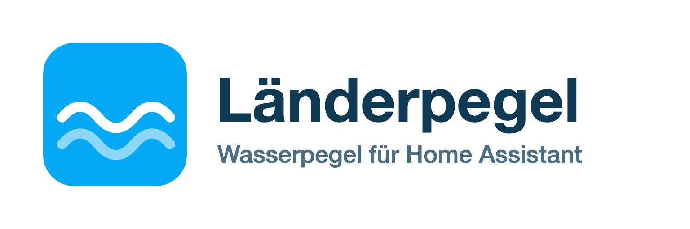

  

# Länderpegel for Home Assistant

A custom Home Assistant integration for **German state river gauge (Wasserpegel) data**. It covers the
operational gauge networks of 14 German states with live water levels, measurement history
(provider-dependent, 1 day to 30 days), 24 h min/max and – where the portal provides it – the
current flood alert level (Warnstufe).

This repository also contains the companion integration **PEGELONLINE (WSV)** for the federal
waterway gauges, see below.

## Supported states

| State | Source | Unit | History | Alert level |
|---|---|---|---|---|
| Baden-Württemberg | hvz.baden-wuerttemberg.de | cm | current value | – |
| Brandenburg | pegelportal.brandenburg.de | cm | 30 days | yes |
| Bayern | gkd.bayern.de | cm | 7 days | – |
| Hamburg | wabiha.de | m (NHN) | current value | yes |
| Hessen | hlnug.de | cm | 48 h | – |
| Mecklenburg-Vorpommern | fis-wasser-mv.de | cm | 14 days | – |
| Niedersachsen | NLWKN / BfG (BIS REST) | cm | 30 days | – |
| Nordrhein-Westfalen | hochwasserportal.nrw | cm | 7 days | – |
| Rheinland-Pfalz | hochwasser.rlp.de | m (NHN) | 7 days | – |
| Saarland | saarland.de | cm | current value | – |
| Sachsen | HWIMS / LfULG | cm | 1 day | yes |
| Sachsen-Anhalt | hvz.lsaurl.de | cm | 7 days | – |
| Schleswig-Holstein | hsi-sh.de | cm | 14 days | – |
| Thüringen | hnz.thueringen.de | cm | current value | yes |

Not available:

- **Bremen** – no own state gauge network
- **Berlin** – `wasserportal.berlin.de` is currently in maintenance; can be added once it is back

## PEGELONLINE (WSV)

The second integration in this repository, `pegelonline`, covers the **federal waterway gauges**
(Rhein, Elbe, Main, Donau, Weser, …) via the public PEGELONLINE v2 REST API of the German waterway
administrations (WSV).

> **Note:** recent Home Assistant versions ship a core `pegel_online` integration that searches
> for gauges near a map location. This `pegelonline` integration selects a waterway directly
> (e.g. Elbe, Rhein) and lists all of its gauges — no map location needed. In the *Add
> Integration* dialog it is listed as **PEGELONLINE (WSV)**.

Each station creates:

- `sensor.<station>_wasserstand` – current water level with unit, timestamp and, if published,
  the gauge zero point
- `sensor.<station>_vorhersage` – forecast value with the 24 h minimum and maximum; created
  automatically when the station publishes a `WV` time series

Configuration: *Settings → Devices & Services → Add Integration* → **PEGELONLINE**, then search
for the station by name or number.

## Installation

### HACS

1. Add this repository as a custom repository in HACS (category: *Integration*).
2. Install *Länderpegel*.
3. Restart Home Assistant.

### Manual

1. Copy the `custom_components/laenderpegel` folder into your Home Assistant configuration directory.
2. Restart Home Assistant.

## Configuration

1. *Settings → Devices & Services → Add Integration* → **Länderpegel**
2. Choose the state, then the waterway (Gewässer) and the gauge station.

Each station creates:

- `sensor.<station>_wasserstand` – current water level with unit, timestamp, 24 h min/max and –
  if known – the gauge zero point (Pegelnullpunkt)
- `binary_sensor.<station>_warnstufe` – active flood alert level (only for Brandenburg, Hamburg,
  Sachsen and Thüringen)

If a selected gauge has no data at all (e.g. it has been decommissioned), the setup is aborted
with a clear message instead of creating an entry that would fail to load.

## Polling

Data is polled every 15 minutes. No API keys or credentials are required; all portals are public.

## License

MIT, see [LICENSE](LICENSE). Data © the respective state water authorities.
